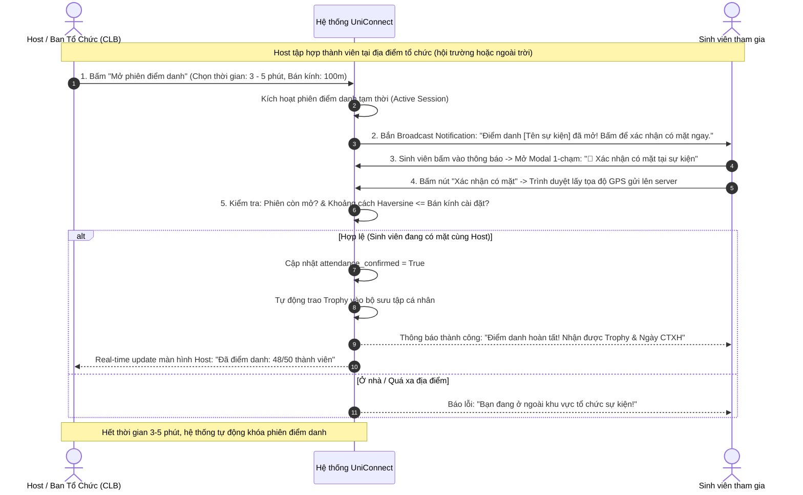
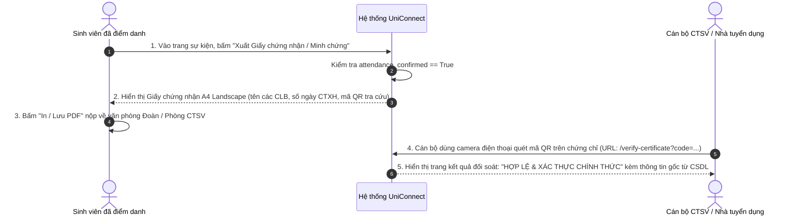
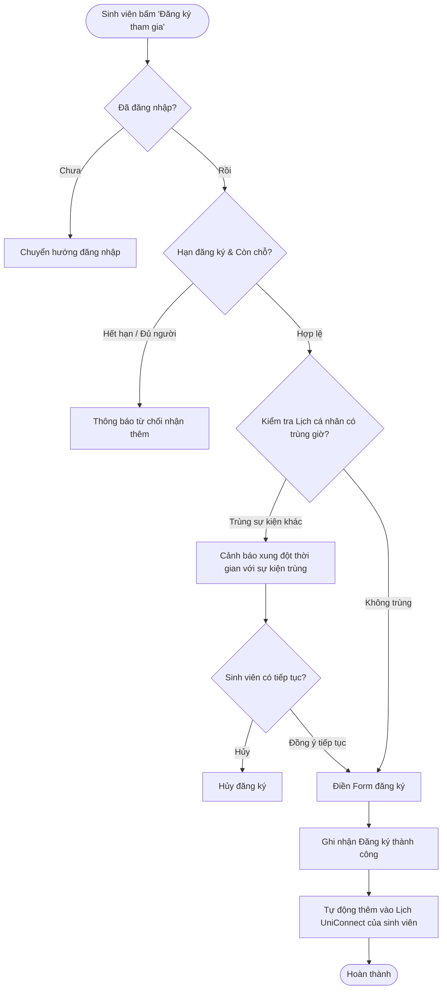

# TÀI LIỆU ĐẶC TẢ NGHIỆP VỤ HỆ THỐNG UNICONNECT
> **Phiên bản:** 2.6 (Bổ sung Hoạt động Liên CLB & Điểm danh Radar GPS 1-Chạm qua Thông báo tức thời)  
> **Dự án:** UniConnect - Nền tảng Kết nối & Quản trị Hoạt động Sinh viên, Câu lạc bộ và Công tác Xã hội  
> **Ngày cập nhật:** 17/09/2026  
> **Tài liệu tham chiếu:** Hệ thống API Backend FastAPI + Giao diện Người dùng React TypeScript + Cơ sở dữ liệu PostgreSQL / PostGIS

---

## MỤC LỤC
1. [TỔNG QUAN DỰ ÁN & MỤC TIÊU HỆ THỐNG](#1-tổng-quan-dự-án--mục-tiêu-hệ-thống)
2. [CÁC NHÓM TÁC NHÂN & MA TRẬN PHÂN QUYỀN (RBAC)](#2-các-nhóm-tác-nhân--ma-trận-phân-quyền-rbac)
3. [ĐẶC TẢ CHI TIẾT CÁC PHÂN HỆ NGHIỆP VỤ](#3-đặc-tả-chi-tiết-các-phân-hệ-nghiệp-vụ)
   - [3.1. Phân hệ Xác thực & Quản lý Hồ sơ Người dùng (Auth & Users)](#31-phân-hệ-xác-thực--quản-lý-hồ-sơ-người-dùng)
   - [3.2. Phân hệ Quản lý Hoạt động & Sự kiện (Bao gồm Hoạt động Liên CLB)](#32-phân-hệ-quản-lý-hoạt-động--sự-kiện-bao-gồm-hoạt-động-liên-clb)
   - [3.3. Phân hệ Đăng ký & Biểu mẫu Tùy biến (Participation & Dynamic Forms)](#33-phân-hệ-đăng-ký--biểu-mẫu-tùy-biến)
   - [3.4. Phân hệ Điểm danh Chống gian lận & Trao Trophy (Tích hợp Điểm danh Radar GPS 1-Chạm)](#34-phân-hệ-điểm-danh-chống-gian-lận--trao-trophy)
   - [3.5. Phân hệ Xuất Minh chứng CTXH & Xác thực Trực tuyến (Certificates & Verification)](#35-phân-hệ-xuất-minh-chứng-ctxh--xác-thực-trực-tuyến)
   - [3.6. Phân hệ Lịch cá nhân & Phát hiện Xung đột (Smart Calendar)](#36-phân-hệ-lịch-cá-nhân--phát-hiện-xung-đột)
   - [3.7. Phân hệ Câu lạc bộ, Cộng đồng & Cơ chế Đồng tổ chức (Groups & Co-hosting)](#37-phân-hệ-câu-lạc-bộ-cộng-đồng--cơ-chế-đồng-tổ-chức)
   - [3.8. Phân hệ Tương tác Xã hội & Thông báo Thời gian thực (Social & Notifications)](#38-phân-hệ-tương-tác-xã-hội--thông-báo-thời-gian-thực)
   - [3.9. Phân hệ Trợ lý AI Sinh viên Thông minh (Campus AI Assistant)](#39-phân-hệ-trợ-lý-ai-sinh-viên-thông-minh)
   - [3.10. Phân hệ Báo cáo Vi phạm & Kiểm duyệt Nội dung (Reports & Moderation)](#310-phân-hệ-báo-cáo-vi-phạm--kiểm-duyệt-nội-dung)
   - [3.11. Phân hệ Bảng điều khiển Quản trị Hệ thống (Admin Dashboard)](#311-phân-hệ-bảng-điều-khiển-quản-trị-hệ-thống)
4. [QUY TRÌNH NGHIỆP VỤ ĐIỂN HÌNH (WORKFLOWS)](#4-quy-trình-nghiệp-vụ-điển-hình-workflows)
   - [4.1. Quy trình Điểm danh Radar GPS 1-Chạm qua Thông báo tức thời](#41-quy-trình-điểm-danh-radar-gps-1-chạm-qua-thông-báo-tức-thời)
   - [4.2. Quy trình Phối hợp Đồng tổ chức giữa các CLB (Co-hosting Workflow)](#42-quy-trình-phối-hợp-đồng-tổ-chức-giữa-các-clb-co-hosting-workflow)
   - [4.3. Quy trình Xuất Giấy chứng nhận CTXH & Tra cứu trực tuyến](#43-quy-trình-xuất-giấy-chứng-nhận-ctxh--tra-cứu-trực-tuyến)
   - [4.4. Quy trình Đăng ký & Kiểm tra xung đột lịch](#44-quy-trình-đăng-ký--kiểm-tra-xung-đột-lịch)
5. [QUY CHUẨN AN TOÀN, BẢO MẬT & CHỐNG GIAN LẬN](#5-quy-chuẩn-an-toàn-bảo-mật--chống-gian-lận)

---

## 1. TỔNG QUAN DỰ ÁN & MỤC TIÊU HỆ THỐNG

### 1.1. Bối cảnh & Vấn đề thực tiễn
Tại các trường đại học, việc quản lý hoạt động ngoại khóa, phong trào đoàn hội và công tác xã hội thường gặp các rào cản:
- **Thông tin phân tán:** Sinh viên theo dõi sự kiện qua nhiều kênh mạng xã hội, dễ bỏ lỡ hạn đăng ký hoặc bị trùng lịch thi, lịch học.
- **Gian lận điểm danh:** Sinh viên nhờ bạn bè ở nhà quét mã QR chụp màn hình để lấy điểm rèn luyện hoặc ngày CTXH.
- **Bất tiện tại sự kiện ngoài trời / đông người:** Đi dọn rác, hiến máu, chạy bộ, teambuilding không có máy chiếu lớn để chiếu mã QR xoay 30 giây; sinh viên phải xếp hàng chen chúc nhau quét camera gây tắc nghẽn.
- **Hoạt động phối hợp liên CLB thiếu cơ chế quản lý chung:** Khi nhiều CLB/Đoàn khoa cùng hợp tác tổ chức một sự kiện lớn, chưa có hệ thống cho phép cùng quản lý danh sách đăng ký, cùng điểm danh và cùng đứng tên trên chứng nhận.
- **Xác nhận thủ công rườm rà & Nguy cơ làm giả:** Phòng Công tác Sinh viên (CTSV) mất nhiều thời gian thu thập giấy tờ, đối chiếu danh sách tham gia để cấp chứng nhận ngày công tác xã hội; file PDF thông thường thiếu cơ chế tra cứu tính nguyên bản.

### 1.2. Mục tiêu hệ thống UniConnect
UniConnect giải quyết toàn diện bài toán trên với một nền tảng tập trung:
1. **Kết nối sinh viên - CLB - Nhà trường:** Tạo hệ sinh thái khép kín từ khâu công bố sự kiện, hợp tác liên CLB (Co-hosting), đăng ký biểu mẫu, đến quản trị nhóm và cộng đồng.
2. **Điểm danh chống gian lận đa dạng & hiện đại:** 
   - Điểm danh **Radar GPS 1-Chạm qua Thông báo tức thời**: Host mở phiên 3 phút $\rightarrow$ Sinh viên nhận thông báo và bấm 1 chạm xác nhận vị trí ngay tại chỗ, không cần mở camera hay tìm mã QR.
   - Điểm danh **Mã QR xoay động 30 giây (HMAC TOTP)** kết hợp Hàng rào địa lý GPS.
   - Điểm danh **Tự động** khi hết giờ và **Tick thủ công**.
3. **Cơ chế cấp chứng chỉ số & Tra cứu tức thời:** Cấp Giấy chứng nhận / Minh chứng ngày CTXH chuẩn A4 Landscape có mã QR dẫn về cổng tra cứu công khai trực tiếp trên hệ thống UniConnect.
4. **Trợ lý AI & Lịch thông minh:** Cảnh báo trùng lịch học/lịch sự kiện, tự động gợi ý hoạt động theo sở thích sinh viên.

---

## 2. CÁC NHÓM TÁC NHÂN & MA TRẬN PHÂN QUYỀN (RBAC)

### 2.1. Các nhóm tác nhân (User Roles)
1. **Khách vãng lai (Guest):** Người chưa đăng nhập. Xem sự kiện công khai và quét mã QR tra cứu tính xác thực của chứng nhận.
2. **Sinh viên (Student / Regular User):** Tài khoản sinh viên tiêu chuẩn. Tham gia sự kiện, điểm danh 1 chạm nhận Trophy, xuất chứng nhận CTXH, quản lý lịch cá nhân, tham gia CLB, chat với trợ lý AI.
3. **Ban tổ chức / Câu lạc bộ (Verified Organization):** Đơn vị tổ chức đã được cấp huy hiệu xác minh (`is_verified = True`). Có quyền:
   - Tạo sự kiện có cấp **Ngày CTXH** (`social_work_days`) và gắn **Trophy độc quyền**.
   - Mời các CLB khác cùng **Đồng tổ chức (Co-hosting)**.
   - Thiết lập hình thức điểm danh (Radar GPS 1-Chạm, Quét mã QR xoay 30s, Tự động, Thủ công).
4. **Cán bộ quản lý giáo dục (Education Admin):** Cán bộ Phòng CTSV / Văn phòng Đoàn trường. Giám sát, phê duyệt hoạt động, kiểm tra và xác thực danh sách CTXH của sinh viên toàn trường.
5. **Quản trị viên hệ thống (Super Admin):** Toàn quyền kiểm soát hệ thống, phê duyệt cấp quyền Verified Organization, xử lý báo cáo vi phạm, quản trị dữ liệu và xem báo cáo thống kê toàn diện.

### 2.2. Ma trận phân quyền nghiệp vụ (Permission Matrix)

| Nghiệp vụ | Khách | Sinh viên | Verified Org | Edu Admin | Super Admin |
| :--- | :---: | :---: | :---: | :---: | :---: |
| Xem sự kiện công khai & tra cứu chứng chỉ | ✅ | ✅ | ✅ | ✅ | ✅ |
| Đăng ký tham gia hoạt động & hủy đăng ký | ❌ | ✅ | ✅ | ✅ | ✅ |
| Nhận thông báo điểm danh & bấm 1 chạm GPS | ❌ | ✅ | ✅ | ✅ | ✅ |
| Xuất Giấy chứng nhận / Minh chứng PDF | ❌ | ✅ | ✅ | ✅ | ✅ |
| Đồng bộ Lịch & Cảnh báo xung đột thời gian | ❌ | ✅ | ✅ | ✅ | ✅ |
| Tạo sự kiện có cấp Ngày CTXH & gắn Trophy | ❌ | ❌ | ✅ | ✅ | ✅ |
| Mời CLB khác cùng Đồng tổ chức (Co-host) | ❌ | ❌ | ✅ (CLB Chủ trì) | ✅ | ✅ |
| Duyệt / Chấp nhận lời mời Đồng tổ chức | ❌ | ❌ | ✅ (BCN CLB được mời)| ✅ | ✅ |
| Mở phiên điểm danh Radar GPS / Chiếu QR | ❌ | ❌ (chỉ sự kiện mình) | ✅ (Host & Co-host) | ✅ | ✅ |
| Quản lý thành viên & hoạt động Câu lạc bộ | ❌ | Member / Admin nhóm | Admin nhóm | ✅ | ✅ |
| Gửi báo cáo nội dung vi phạm (Report) | ❌ | ✅ | ✅ | ✅ | ✅ |
| Duyệt huy hiệu Tổ chức uy tín (Verify Org) | ❌ | ❌ | ❌ | ✅ | ✅ |
| Xử lý Báo cáo vi phạm & Khóa tài khoản | ❌ | ❌ | ❌ | ❌ | ✅ |
| Xem Thống kê KPI & Dashboard Quản trị | ❌ | ❌ | ❌ | ✅ | ✅ |

---

## 3. ĐẶC TẢ CHI TIẾT CÁC PHÂN HỆ NGHIỆP VỤ

### 3.1. Phân hệ Xác thực & Quản lý Hồ sơ Người dùng (Auth & Users)
- **Phương thức xác thực:** Đăng ký/đăng nhập mật khẩu mã hóa Bcrypt; tích hợp Đăng nhập nhanh Google OAuth2; quản lý phiên bằng JWT Access/Refresh Token.
- **Hồ sơ sinh viên (User Profile):** Họ tên, MSSV, Trường học, Khoa/Viện, Niên khóa, Số điện thoại, Email, Avatar, Bio, Sở thích (Interests).
- **Thống kê chỉ số cá nhân:** Số hoạt động đã tham gia, Tổng số ngày CTXH đã tích lũy, Điểm rèn luyện, Điểm cống hiến.
- **Bộ sưu tập Trophy (Trophy Showcase):** Trưng bày huy hiệu danh dự thu hoạch được từ các sự kiện đã tham gia và điểm danh thành công.

---

### 3.2. Phân hệ Quản lý Hoạt động & Sự kiện (Bao gồm Hoạt động Liên CLB)

#### 3.2.1. Quản lý vòng đời & Thiết lập thông tin
- **Thông tin sự kiện:** Tiêu đề, tóm tắt, mô tả chi tiết bài viết (Rich-text format), ảnh bìa, phân loại danh mục, số lượng người tham gia tối đa (`max_participants`).
- **Định vị & Bản đồ số:** Tích hợp Leaflet Maps / Nominatim API, lưu tọa độ GPS (`latitude`, `longitude`, `location_name`) phục vụ việc xác thực địa điểm và bán kính điểm danh.
- **Khung thời gian:** Quản lý 3 mốc: Hạn chót đăng ký (`registration_deadline`), Giờ bắt đầu (`start_time`), Giờ kết thúc (`end_time`).
- **Vòng đời trạng thái:** `DRAFT` $\rightarrow$ `PUBLISHED` $\rightarrow$ `ONGOING` $\rightarrow$ `COMPLETED` $\rightarrow$ `CANCELLED`.

#### 3.2.2. Nghiệp vụ Hoạt động Liên CLB / Đồng tổ chức (Co-hosted Activities)
- **Bản chất nghiệp vụ:** Đáp ứng các sự kiện quy mô lớn có sự phối hợp giữa nhiều đơn vị (ví dụ: CLB Tin học 🤝 CLB Tiếng Anh tổ chức Tech Talk).
- **Mô hình quản lý:**
  - **`1 Lead Host (CLB Chủ trì chính)`**: Đơn vị khởi tạo sự kiện, chịu trách nhiệm pháp lý cao nhất, có quyền chỉnh sửa thông tin cốt lõi, xóa/hủy sự kiện và gửi lời mời đến các CLB khác.
  - **`N Co-Hosts (Các CLB Đồng tổ chức)`**: Các đơn vị được mời tham gia phối hợp.
- **Cơ chế Mời & Phê duyệt (Invitation & Acceptance Workflow):**
  - Tránh việc CLB A tự ý gán tên CLB B khi chưa được đồng ý.
  - CLB chủ trì chọn danh sách các CLB đồng tổ chức trong form tạo/sửa sự kiện $\rightarrow$ Hệ thống gửi thông báo lời mời đến Ban chủ nhiệm các CLB được mời với trạng thái `pending`.
  - Ban chủ nhiệm CLB đối tác vào xem thông tin và chọn **"Chấp nhận (Accept)"** hoặc **"Từ chối (Decline)"**.
  - Khi được chấp nhận (`accepted`), sự kiện chính thức chuyển sang chế độ Đồng tổ chức.
- **Quyền hạn của CLB Đồng tổ chức:**
  - Xuất hiện logo và tên trên Thẻ sự kiện, Trang chi tiết và Giấy chứng nhận CTXH.
  - Sự kiện tự động hiển thị trên Tab "Hoạt động" của tất cả các CLB đồng tổ chức.
  - Ban chủ nhiệm các CLB đồng tổ chức được cấp quyền: xem danh sách đăng ký, mở phiên điểm danh, hỗ trợ tick điểm danh cho sinh viên.
  - Điểm phong trào và số lượt sinh viên tham gia được tính cộng dồn thành tích (KPI) cho tất cả các CLB tham gia đồng tổ chức.

---

### 3.3. Phân hệ Đăng ký & Biểu mẫu Tùy biến (Participation & Dynamic Forms)
- **Đăng ký tham gia:** Bấm "Đăng ký", kiểm tra thời hạn, số lượng còn lại, kiểm tra xung đột thời gian với lịch cá nhân.
- **Biểu mẫu đăng ký tùy biến (Custom Dynamic Forms):**
  - Ban tổ chức thiết kế câu hỏi thu thập thông tin người tham gia.
  - Hỗ trợ trường: Text ngắn, Đoạn văn bản dài, Single choice, Multiple choice, Upload file minh chứng (ảnh thẻ SV, CV).
  - Xuất danh sách phản hồi ra tệp CSV/Excel phục vụ công tác tổ chức.

---

### 3.4. Phân hệ Điểm danh Chống gian lận & Trao Trophy

#### 3.4.1. Bốn chế độ điểm danh linh hoạt (`attendance_mode`)
1. **`radar` (Điểm danh Radar GPS 1-Chạm qua Thông báo tức thời - KHUYÊN DÙNG):**
   - Host tập hợp sinh viên tại địa điểm, bấm **"Mở phiên điểm danh"** (mở cửa sổ trong 3 - 5 phút).
   - Hệ thống tự động bắn thông báo đẩy (Broadcast Notification) tới tất cả sinh viên đã đăng ký.
   - Sinh viên bấm vào thông báo $\rightarrow$ Popup 1-chạm xuất hiện $\rightarrow$ Bấm **"Xác nhận có mặt"**. Trình duyệt tự động lấy GPS gửi lên server.
   - Server kiểm tra thời gian phiên và khoảng cách GPS Haversine. Nếu hợp lệ, tự động xác nhận có mặt và trao Trophy.
   - Màn hình của Host cập nhật danh sách và số lượng người có mặt nhảy số thời gian thực (Real-time counter).
   - **Ưu điểm vượt trội:** Không cần máy chiếu, không cần quét camera, không lo chói sáng/camera mờ, cực kỳ phù hợp cho hoạt động ngoài trời, dọn rác, teambuilding, phong trào đông người.
2. **`qr_code` (Quét mã QR xoay động 30 giây + GPS Geofencing):**
   - Host chiếu màn hình mã QR tại hội trường.
   - Mã tự xoay mỗi 30 giây bằng HMAC-SHA256 TOTP, chống chụp ảnh gửi về nhà.
   - Sinh viên quét mã và gửi kèm tọa độ GPS kiểm tra bán kính.
3. **`manual` (Host tick thủ công):**
   - Host và Ban tổ chức các CLB đồng tổ chức trực tiếp duyệt danh sách người tham gia trên web.
4. **`auto` (Tự động khi kết thúc sự kiện):**
   - Áp dụng cho hội thảo trực tuyến / webinar: tự động xác nhận có mặt cho toàn bộ người đăng ký khi thời gian hiện tại $\ge$ `end_time`.

#### 3.4.2. Cơ chế tự động trao Trophy (Gamification)
- Khi điểm danh thành công (`attendance_confirmed = True`):
  - Hệ thống kiểm tra xem hoạt động có gắn `trophy_id` hay không.
  - Kiểm tra tính duy nhất (Idempotent): Cấp phát Trophy vào bảng `user_trophies` và gửi thông báo chúc mừng.
  - Trophy lập tức hiển thị trên Profile cá nhân của sinh viên.

---

### 3.5. Phân hệ Xuất Minh chứng CTXH & Xác thực Trực tuyến (Certificates & Verification)

#### 3.5.1. Xuất Giấy chứng nhận / Minh chứng Ngày CTXH (PDF Export)
- **Điều kiện xuất:** Chỉ sinh viên đã **xác nhận điểm danh thành công** (`attendance_confirmed == True`) mới có nút xuất chứng nhận.
- **Nội dung chuẩn hóa A4 Landscape:**
  - Quốc hiệu, Tiêu ngữ, Tên nền tảng UniConnect.
  - Danh hiệu: "GIẤY CHỨNG NHẬN THAM GIA HOẠT ĐỘNG / MINH CHỨNG CTXH".
  - Thông tin sinh viên: Họ và tên, MSSV, Email.
  - Thông tin sự kiện: Tên hoạt động, Thời gian diễn ra, Địa điểm.
  - **Đơn vị tổ chức:** Tự động hiển thị tên CLB chủ trì và các CLB đồng tổ chức (ví dụ: *Đoàn khoa CNTT phối hợp cùng CLB Tin học & CLB Tiếng Anh*).
  - Số ngày Công tác Xã hội công nhận (ví dụ: `1.0 ngày CTXH`, `2.0 ngày CTXH`) hoặc Điểm rèn luyện.
  - Chữ ký điện tử của Đại diện Ban tổ chức và Dấu mộc xác thực điện tử của UniConnect.
  - **Mã định danh chứng nhận duy nhất:** Chuẩn `UC-[HEX_ACTIVITY]-[HEX_USER]` (ví dụ: `UC-A8F31C-9D4E21`).
  - **Mã QR xác thực in trực tiếp:** Quét dẫn thẳng tới đường dẫn tra cứu trực tuyến.
- **Tiêu chuẩn in:** Cấu hình `@media print` tối ưu cho khổ giấy A4 Nằm ngang, tự động ẩn giao diện web, in trực tiếp ra giấy hoặc lưu file PDF nộp về Phòng CTSV.

#### 3.5.2. Cổng tra cứu & Xác thực trực tuyến công khai (Online Verification Portal)
- Đường dẫn công khai: `/verify-certificate?code=UC-XXXXXX-XXXXXX` (Không cần đăng nhập).
- Bất kỳ ai (cán bộ CTSV, nhà tuyển dụng) dùng camera quét mã QR trên chứng nhận giấy/PDF sẽ thấy ngay trang xác thực chính thức:
  - Tích xanh: **HỢP LỆ & ĐÃ ĐỐI SOÁT CHÍNH THỨC**.
  - Chi tiết người nhận, sự kiện, đơn vị chủ trì & đồng tổ chức, số ngày CTXH và thời điểm điểm danh.
  - Chống tuyệt đối hành vi photoshop/chỉnh sửa file PDF.

---

### 3.6. Phân hệ Lịch cá nhân & Phát hiện Xung đột (Smart Calendar)
- **Hợp nhất 3 luồng dữ liệu:**
  1. Hoạt động UniConnect đã đăng ký.
  2. Lịch cá nhân tự tạo (lịch học, lịch thi, việc bận).
  3. Đồng bộ hai chiều với Google Calendar.
- **Thuật toán phát hiện xung đột lịch:**
  - Khi chuẩn bị đăng ký sự kiện mới hoặc thêm lịch cá nhân, hệ thống kiểm tra giao thoa khoảng thời gian `[start_time, end_time]`.
  - Hiển thị cảnh báo trực quan nếu bị trùng giờ: *"Bạn đã có lịch [Tên sự kiện] vào khung giờ này"*.
- **Chế độ xem:** Tháng, Tuần, Ngày, Danh sách việc cần làm (Agenda).

---

### 3.7. Phân hệ Câu lạc bộ, Cộng đồng & Cơ chế Đồng tổ chức (Groups & Co-hosting)
- **Quản lý CLB:** Tên, Giới thiệu, Logo, Ảnh bìa, Lĩnh vực, Chế độ nhóm (Công khai / Riêng tư cần duyệt).
- **Phân cấp vai trò trong nhóm:** `Admin` (Chủ nhiệm), `Moderator` (Phó chủ nhiệm / BQT), `Member` (Thành viên).
- **Hộp thư Lời mời Phối hợp (Co-host Invitations Box):** Nơi Ban chủ nhiệm CLB tiếp nhận, xem xét và phê duyệt các lời mời đồng tổ chức từ các CLB khác trong trường.
- **Bảng tin & Hoạt động nội bộ:** Thảo luận, thông báo và tạo sự kiện độc quyền nội bộ.

---

### 3.8. Phân hệ Tương tác Xã hội & Thông báo Thời gian thực (Social & Notifications)
- **Tương tác:** Thích (Like), Bình luận và Trả lời đa cấp (Nested Comments), Chia sẻ liên kết, Bookmark lưu sự kiện.
- **Trung tâm thông báo (Notification Center):**
  - **Thông báo khẩn cấp điểm danh:** Bắn thông báo ngay khi Host mở phiên điểm danh Radar 1-chạm.
  - Thông báo nhắc nhở sự kiện trước 24h và 1h.
  - Thông báo duyệt đơn tham gia, thông báo nhận Trophy, thông báo mời tham gia CLB.

---

### 3.9. Phân hệ Trợ lý AI Sinh viên Thông minh (Campus AI Assistant)
- **Kiến trúc RAG:** Sử dụng mô hình nhúng vector (PostgreSQL `pgvector`) trên dữ liệu sự kiện, quy chế và hoạt động CLB.
- **Tính năng trợ lý:** Trả lời tự nhiên về các hoạt động cấp ngày CTXH, kiểm tra thời gian rảnh trong tuần và gợi ý sự kiện phù hợp với sở thích của sinh viên.

---

### 3.10. Phân hệ Báo cáo Vi phạm & Kiểm duyệt Nội dung (Reports & Moderation)
- Nút "Báo cáo" trên các bài đăng, bình luận có dấu hiệu spam, lừa đảo, sai sự thật.
- Hàng đợi kiểm duyệt dành cho Quản trị viên (Admin Reports Queue): Ẩn nội dung, cảnh cáo, hoặc khóa tài khoản vi phạm.

---

### 3.11. Phân hệ Bảng điều khiển Quản trị Hệ thống (Admin Dashboard)
- Thống kê KPI toàn trường: Số lượng người dùng hoạt động (DAU/MAU), Tổng số ngày CTXH đã cấp, Tỷ lệ tham gia thực tế.
- Xét duyệt huy hiệu Tổ chức uy tín (`is_verified`) cho các CLB/Đoàn khoa nộp hồ sơ minh chứng.
- Quản lý phân quyền người dùng (`student` ↔ `organization` ↔ `education_admin`).

---

## 4. QUY TRÌNH NGHIỆP VỤ ĐIỂN HÌNH (WORKFLOWS)

### 4.1. Quy trình Điểm danh Radar GPS 1-Chạm qua Thông báo tức thời


---

### 4.2. Quy trình Phối hợp Đồng tổ chức giữa các CLB (Co-hosting Workflow)
```mermaid
sequenceDiagram
    autonumber
    actor LeadHost as CLB A (Chủ trì chính)
    participant System as Hệ thống UniConnect
    actor CoHost as CLB B (Được mời phối hợp)
    actor Student as Sinh viên toàn trường

    LeadHost->>System: 1. Tạo sự kiện: Chọn CLB B vào danh sách "Đồng tổ chức"
    System->>CoHost: 2. Gửi thông báo đến BCN CLB B: "CLB A mời bạn đồng tổ chức sự kiện [Tên sự kiện]"
    
    alt BCN CLB B Chấp nhận (Accept)
        CoHost->>System: 3. Bấm "Chấp nhận đồng tổ chức"
        System->>System: Cập nhật trạng thái = 'accepted'
        System-->>LeadHost: Thông báo: "CLB B đã đồng ý đồng tổ chức sự kiện"
        System-->>Student: Sự kiện hiển thị huy hiệu liên danh: "Tổ chức bởi: CLB A 🤝 CLB B"
        Note over System: Sự kiện tự động xuất hiện trên Bảng tin của cả 2 CLB; cả 2 BCN đều có quyền mở điểm danh
    else BCN CLB B Từ chối (Decline)
        CoHost->>System: Bấm "Từ chối" kèm lý do
        System->>System: Cập nhật trạng thái = 'declined'
        System-->>LeadHost: Thông báo: "CLB B đã từ chối lời mời đồng tổ chức"
    end
```

---

### 4.3. Quy trình Xuất Giấy chứng nhận CTXH & Tra cứu trực tuyến


---

### 4.4. Quy trình Đăng ký & Kiểm tra xung đột lịch


---

## 5. QUY CHUẨN AN TOÀN, BẢO MẬT & CHỐNG GIAN LẬN

1. **Chống gian lận điểm danh kép (Time-window & Geofencing):**
   - Phiên điểm danh Radar chỉ mở trong khung thời gian ngắn (3 - 5 phút) khi các thành viên đang tập hợp trước mặt Host.
   - Khoảng cách thiết bị được tính toán theo tọa độ vệ tinh GPS bằng công thức Haversine; máy chủ từ chối nếu sai số vị trí vượt quá bán kính quy định.
   - Đối với chế độ QR: Token xoay 30 giây bằng HMAC-SHA256 ngăn chặn triệt để hành vi chụp ảnh màn hình gửi qua mạng xã hội.
2. **Bảo mật phân quyền Đồng tổ chức (Co-hosting Security):**
   - CLB được mời phải có hành động xác nhận chủ động từ Ban chủ nhiệm mới được gắn logo và tên vào sự kiện; không ai có thể tự ý mượn danh CLB khác.
   - CLB chủ trì chính giữ quyền tối cao đối với các thao tác hủy, xóa sự kiện để tránh xung đột quản lý.
3. **Chống làm giả chứng chỉ & Minh chứng ngày CTXH:**
   - Mỗi chứng chỉ gắn liền với mã định danh ngẫu nhiên mã hóa duy nhất `UC-[ACTIVITY]-[USER]`.
   - Kết quả tra cứu trực tuyến được truy vấn trực tiếp từ cơ sở dữ liệu gốc của UniConnect, không phụ thuộc vào dữ liệu do người dùng tự khai báo hay file PDF tải về.
4. **Bảo vệ dữ liệu & Tính toàn vẹn:**
   - Giao dịch cập nhật điểm danh và cấp Trophy đảm bảo tính lũy đẳng (Idempotency), không thể nhận trùng lặp nhiều lần cho một hoạt động.
   - Tất cả tương tác nhạy cảm (xóa hoạt động, cấm người dùng, cấp quyền tổ chức) đều ghi nhận lịch sử kiểm toán (Audit Trail) rõ ràng.

---
*Tài liệu được biên soạn và cập nhật tự động đồng bộ với mã nguồn dự án UniConnect.*
