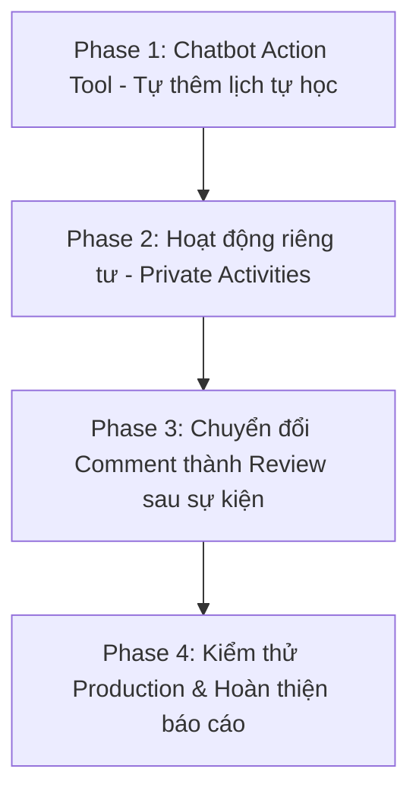

# KẾ HOẠCH NÂNG CẤP VÀ HOÀN THIỆN THEO GÓP Ý CỦA GIẢNG VIÊN PHẢN BIỆN (GVPB)

**ĐỀ TÀI:** XÂY DỰNG NỀN TẢNG UNICONNECT: HỆ THỐNG KẾT NỐI HOẠT ĐỘNG SINH VIÊN DỰA TRÊN BẢN ĐỒ SỐ VÀ TRỢ LÝ ẢO THÔNG MINH  
**SINH VIÊN THỰC HIỆN:** NGUYỄN ĐỨC ĐẠT (MSSV: 2111010)  
**NGÀY LẬP:** 01/10/2026  

---

## I. TỔNG HỢP CÁC GÓP Ý CỐT LÕI TỪ GVPB

| STT | Góp ý của GVPB | Bản chất kỹ thuật & Ý nghĩa nghiệp vụ | Mức độ ưu tiên |
| :---: | :--- | :--- | :---: |
| **1** | **Kiểm thử phải thực hiện trên Production mới có giá trị** | Đo lường hiệu năng, độ trễ và các testcase trên hạ tầng Cloud thật (Vercel CDN + Render Docker + Neon Postgres Serverless), không chỉ dựa vào môi trường lý tưởng `localhost`. | **Cao** |
| **2** | **Cần có các hoạt động người ngoài không thể xem được (Khôi phục Private Activities)** | Phân quyền truy cập hoạt động nội bộ (`privacy = 'private'`): chỉ Host và Thành viên CLB mới xem được trên Bản đồ, Bảng tin và API; người ngoài bị ẩn hoàn toàn (403 Forbidden). | **Rất cao** |
| **3** | **Chatbot nên có Function hành động trực tiếp thay vì chỉ trả lời (Tự thêm vào Lịch cá nhân)** | Nâng cấp AI từ dạng hỏi-đáp thông thường thành **Actionable AI Agent**: tự đối soát lịch rảnh và tự gọi tool thêm lịch tự học (`add_personal_busy_slot`) vào Smart Calendar của sinh viên. | **Cực cao (Điểm nhấn Demo)** |
| **4** | **Comment trong hoạt động nên dành cho phần Review sau khi trải nghiệm** | Chuyển đổi chatbox bình luận chung thành phân hệ **Đánh giá & Cảm nhận sau sự kiện (Post-event Reviews)**, có kiểm soát quyền viết review (chỉ sinh viên đã tham gia mới được đánh giá). | **Cao** |

---

## II. LỘ TRÌNH THỰC HIỆN THEO TỪNG GIAI ĐOẠN (PHASES)

---

### 🚀 PHASE 1: CHATBOT ACTION TOOL — TỰ ĐỘNG THÊM LỊCH TỰ HỌC VÀO SMART CALENDAR
> **Mục tiêu:** Biến Chatbot thành trợ lý thông minh thực thụ, có quyền hành động ghi dữ liệu vào lịch cá nhân khi người dùng yêu cầu tư vấn thời gian tự học.

#### 1. Các tác vụ kỹ thuật cần làm:
1. **Khai báo Tool mới `add_personal_busy_slot`** trong [`server/app/modules/chat/provider.py`](file:///c:/Users/Admin/Code/uniconnect-v2/server/app/modules/chat/provider.py):
   - Nhận các tham số: `title` (tiêu đề lịch tự học/việc bận), `start_time` (ISO datetime), `end_time` (ISO datetime), `recurrence` (one_off / weekly), `day_of_week`.
2. **Xây dựng Adapter thực thi trong [`server/app/modules/chat/tools.py`](file:///c:/Users/Admin/Code/uniconnect-v2/server/app/modules/chat/tools.py):**
   - Gọi trực tiếp hàm nghiệp vụ `cal_service.create_busy_slot`.
   - Kiểm tra xung đột trước khi thêm để đảm bảo không chèn đè lên giờ học khác.
3. **Kết nối vào vòng lặp Tool Execution Guard trong [`server/app/modules/chat/service.py`](file:///c:/Users/Admin/Code/uniconnect-v2/server/app/modules/chat/service.py):**
   - Bắt lời gọi hàm `add_personal_busy_slot`, commit vào Database và trả kết quả thành công kèm `slot_id`.
4. **Cập nhật Prompt System Instruction:**
   - Dạy Gemini kịch bản: Khi sinh viên hỏi *"Với lịch hiện tại, tôi nên xếp thời gian tự học thế nào cho hợp lý?"*:
     - *Bước 1:* Gọi `get_user_schedule` kiểm tra lịch bận tuần tới.
     - *Bước 2:* Tìm các khoảng trống tối ưu (ví dụ: tối thứ 4 từ 19:30 – 21:30).
     - *Bước 3:* Gọi `add_personal_busy_slot` để tạo ngay khung giờ bận.
     - *Bước 4:* Trả lời kèm link xem lịch: `[Lịch Thông Minh](/calendar)`.
5. **Cập nhật Fallback Service ([`fallback.py`](file:///c:/Users/Admin/Code/uniconnect-v2/server/app/modules/chat/fallback.py)):**
   - Hỗ trợ tạo lịch tự học cả khi chạy chế độ dự phòng Level 2.

#### 2. Tiêu chí nghiệm thu (Acceptance Criteria):
- [x] Chat câu hỏi: *"Với lịch hiện tại, tôi nên xếp thời gian tự học thế nào cho hợp lý?"*
- [x] AI trả lời phân tích lịch và xác nhận đã tạo khung giờ tự học.
- [x] Vào trang `/calendar` thấy ngay thẻ sự kiện màu tím "Tự học..." xuất hiện đúng giờ rảnh.

---

### 🔒 PHASE 2: HOẠT ĐỘNG RIÊNG TƯ (PRIVATE / GROUP-ONLY ACTIVITIES)
> **Mục tiêu:** Người ngoài và khách vãng lai hoàn toàn không thể nhìn thấy các hoạt động nội bộ của CLB/Nhóm.

#### 1. Các tác vụ kỹ thuật cần làm:
1. **Siết chặt bộ lọc truy vấn trong Repository ([`server/app/modules/activities/repository.py`](file:///c:/Users/Admin/Code/uniconnect-v2/server/app/modules/activities/repository.py)):**
   - Trong các hàm `list_active` và `find_within_radius`:
     - Nếu `activity.privacy == ActivityPrivacy.private`:
       - Chỉ trả về nếu `user_id` là `host_id` HOẶC `user_id` là thành viên chính thức (`GroupMember`) của CLB tổ chức hoặc CLB đồng tổ chức (`ActivityCoHost`).
       - Nếu không thỏa mãn, loại bỏ hoàn toàn khỏi kết quả query SQL.
2. **Chặn truy cập trực tiếp ID trong Service ([`server/app/modules/activities/service.py`](file:///c:/Users/Admin/Code/uniconnect-v2/server/app/modules/activities/service.py)):**
   - Trong hàm `get_activity`: Nếu người ngoài cố tình truy cập link `/activities/{id}` của sự kiện Private $\rightarrow$ Trả về lỗi `403 Forbidden: "Hoạt động này là nội bộ, chỉ dành riêng cho thành viên nhóm."`
3. **Cập nhật Tool tìm kiếm của Chatbot ([`server/app/modules/chat/tools.py`](file:///c:/Users/Admin/Code/uniconnect-v2/server/app/modules/chat/tools.py)):**
   - Đảm bảo AI không bao giờ gợi ý sự kiện Private cho sinh viên không thuộc nhóm.
4. **Chuẩn bị Dữ liệu Demo (Seed Data):**
   - Tạo 2 hoạt động Private:
     1. *"Họp Ban Chủ nhiệm & Lên kế hoạch quý 4"* — CLB Môi Trường Xanh (Group ID có sẵn).
     2. *"Tập huấn kỹ năng nội bộ Đội CTXH"* — Đội CTXH Bách Khoa.
   - Demo kịch bản 2 tài khoản:
     - Tài khoản A (ngoài CLB): Tìm kiếm không ra, vào map không thấy.
     - Tài khoản B (thành viên CLB): Thấy hoạt động hiển thị có huy hiệu 🔒 **Nội bộ**.

#### 2. Tiêu chí nghiệm thu (Acceptance Criteria):
- [x] Tài khoản chưa vào nhóm không thấy hoạt động private trên Bảng tin, Bản đồ và Chatbot.
- [x] Vào trực tiếp URL bị báo lỗi 403 Forbidden.
- [x] Tài khoản thành viên nhóm xem và tham gia bình thường.

---

### 💬 PHASE 3: CHUYỂN ĐỔI BÌNH LUẬN THÀNH ĐÁNH GIÁ TRẢI NGHIỆM SAU SỰ KIỆN (POST-EVENT REVIEWS)
> **Mục tiêu:** Chuyển đổi tính năng comment thành hệ thống Social Proof chất lượng cao, chỉ người đã tham gia mới được viết cảm nhận.

#### 1. Các tác vụ kỹ thuật cần làm:
1. **Quy tắc nghiệp vụ Backend ([`server/app/modules/interactions/service.py`](file:///c:/Users/Admin/Code/uniconnect-v2/server/app/modules/interactions/service.py)):**
   - Khi gọi `create_comment`:
     - Kiểm tra sinh viên có bản ghi `JoinRequest` với trạng thái `attendance_confirmed == True` (đã được điểm danh) HOẶC là `host_id` của sự kiện.
     - Nếu chưa tham gia sự kiện $\rightarrow$ Ném ngoại lệ `ValidationError("Chức năng đánh giá chỉ dành cho sinh viên đã tham gia và hoàn thành hoạt động.")`.
2. **Cập nhật Giao diện Chi tiết Hoạt động ([`client/src/pages/ActivityDetail/ActivityDetail.tsx`](file:///c:/Users/Admin/Code/uniconnect-v2/client/src/pages/ActivityDetail/ActivityDetail.tsx)):**
   - Đổi tiêu đề khối tương tác: từ *"Bình luận"* $\rightarrow$ **"Đánh giá & Cảm nhận sau sự kiện (Reviews & Feedback)"**.
   - Nếu sinh viên chưa tham gia: Ẩn form nhập hoặc hiển thị thông báo: *"Bạn cần tham gia sự kiện để gửi đánh giá trải nghiệm."*
   - Với những người đã điểm danh thành công: Hiển thị huy hiệu xanh lá cạnh tên: **"✓ Đã tham gia sự kiện"** (Verified Participant).

#### 2. Tiêu chí nghiệm thu (Acceptance Criteria):
- [x] Người chưa tham gia hoặc chưa điểm danh không thể gửi đánh giá, chỉ được đọc đánh giá của người khác.
- [x] Hoạt động chưa kết thúc thì chưa mở tính năng gửi đánh giá trải nghiệm.
- [x] Người đã tham gia & điểm danh hoặc Host gửi cảm nhận thành công sau khi sự kiện kết thúc.

---

### 🌐 PHASE 4: KIỂM THỬ TRÊN PRODUCTION & HOÀN THIỆN HỒ SƠ BẢO VỆ
> **Mục tiêu:** Chuẩn hóa số liệu thực tế đo trên môi trường Cloud thật để thuyết phục hoàn toàn Hội đồng phản biện.

#### 1. Các tác vụ kỹ thuật cần làm:
1. **Đo đạc và thu thập chỉ số trên URL Production thật:**
   - Chạy Google Lighthouse trên URL Vercel production:
     - First Contentful Paint (FCP).
     - Largest Contentful Paint (LCP).
     - Cumulative Layout Shift (CLS).
   - Bật Network Throttling (Slow 3G) đo thời gian tải bundle 72.2 kB (Gzip) đạt chuẩn 1.3s.
2. **Cập nhật Slide Thuyết trình (Slide 11):**
   - Ghi rõ tiêu đề: **"KIỂM THỬ & ĐO LƯỜNG TRÊN PRODUCTION"**.
   - Bổ sung chú thích: *"Môi trường thử nghiệm: Frontend Vercel Edge CDN, Backend Render Cloud, Database Neon Serverless."*
3. **Cập nhật Kịch bản bảo vệ ([`kich_ban_thuyet_trinh_bao_ve_luan_van.md`](file:///c:/Users/Admin/Code/uniconnect-v2/kich_ban_thuyet_trinh_bao_ve_luan_van.md)):**
   - Bổ sung lời thoại nhấn mạnh việc toàn bộ 100 testcase chạy qua GitHub Actions CI độc lập và đo đạc trên production thật.

#### 2. Tiêu chí nghiệm thu (Acceptance Criteria):
- [ ] Slide và script nói thể hiện rõ ràng chữ "Production Environment".
- [ ] Sẵn sàng các ảnh chụp màn hình Lighthouse và Network tab để trình chiếu nếu Hội đồng yêu cầu xem minh chứng.

---

## III. THỨ TỰ BẮT ĐẦU TRIỂN KHAI

| Thứ tự | Hạng mục công việc | File ảnh hưởng chính | Thời gian dự kiến |
| :---: | :--- | :--- | :---: |
| **Bước 1** | **Phase 1: Chatbot Action Tool (Tự thêm lịch tự học)** | `provider.py`, `tools.py`, `service.py` | 15 – 20 phút |
| **Bước 2** | **Phase 2: Hoạt động riêng tư (Private Activities)** | `repository.py`, `service.py`, `ActivityDetail.tsx` | 15 – 20 phút |
| **Bước 3** | **Phase 3: Review sau sự kiện** | `interactions/service.py`, `ActivityDetail.tsx` | 15 phút |
| **Bước 4** | **Phase 4: Cập nhật Slide & Script thuyết trình** | `kich_ban_thuyet_trinh_bao_ve_luan_van.md` | 10 phút |
